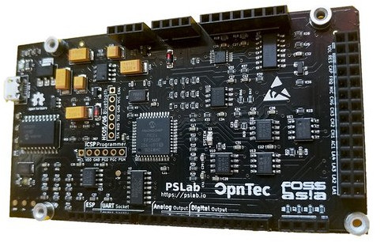

## Pocket Science Lab ベアボーンボード

試験および計測を行うための小型のオープンソースハードウェアです。様々なセンサによる拡張が容易で、AndroidアプリやLinuxデスクトップアプリケーションを用いて簡単に制御できます。

オシロスコープやマルチメータ、シグナルジェネレータとして利用することが可能です。ソフトウェアが提供されているので、プログラミングは不要です。

### 特徴

**オシロスコープ**

本製品の主要機能のうちの一つに、最大2 Msps 4チャンネルのデジタルオシロスコープがあります。トリガー設定やゲイン選択といった制御ができます。

**シグナルジェネレータ**

*   SI1：5 Hz ～ 5 KHzの任意波形生成
    *   +/-3 Vの範囲で振幅を手動制御
*   SI2：5 Hz ～ 5 KHzの任意波形生成
    *   +/-3 Vの振幅
    *   ソフトウェアを介して減衰可能
*   SQx：最大周波数32 MHz、デューティ比分解能15 ns、位相設定可能な4チャンネルPWM出力

**測定機能**

*   16 MHzまでを試験済みの周波数カウンタ
*   pFからuFレンジの静電容量計測
*   本製品には、ゲインを調整可能ないくつかの12 bit アナログ入力（電圧計としても機能）と、+/-5 mV～+/-16 Vで変動する最大範囲があります

**DC電源**

*   最大3.3 mAの12 bit固定電流源（負荷抵抗の影響を受けます）
*   三つのプログラム可能な12 bit電圧源があります
    *   +/-3.3 V、+/-5 V、0～3 V
    *   制御：PV1、 PV2、 PV3

**拡張制御**

*   オシロスコープを用いた拡張制御
*   データロガー
*   ロジックアナライザ

**その他**

*   分解能15 nsの4 MHz、4チャンネルのロジックアナライザ。電圧/電流源。
*   SPI、I2C、UART出力
*   無線データ収集のための2.4 GHz送信機を別途搭載可能（ファームウェア準備中）
    *   現時点では工事設計認証（いわゆる技適）の取得は未確認
*   オシロスコープやロジックアナライザ、ストリーミングデータ、無線取得のために、制御およびプロットウィジェットを組み込むのに必要なコードを大幅に削減する共通のフレームワークを使用した、いくつかの実験用グラフィカルインタフェース
*   アクセスポイント/ステーションモードのW-Fiを利用するため、基板裏面にESP8266モジュール用スペースを用意（ファームウェア準備中）ESP-WROOM-02 は大きさの関係で搭載できません）

### 仕様

*   4チャンネル × 2 Mspsまでのオシロスコープ
    *   アンプステージを選択できるソフトウェア
*   ゲインをプログラム可能な12 bitの電圧計
    *   入力範囲：+/-10 mV～+/-16 V
*   3 x 12 bit プログラム可能な電圧源：+/-3.3 V、+/-5 V、0～3 V
*   12 bit プログラム可能な電流源：0～3.3 mA
*   拡張プラグイン/アドオンモジュールが利用可能
*   4チャンネル、4 MHzのロジックアナライザ
*   2 × 正弦波/三角波生成器
    *   5 Hz～5 KHz
    *   SI1用の手動振幅制御
*   4 × PWM生成器
    *   解像度：15 ns
    *   8 MHzまで
*   pFからuFレンジの静電容量計測
*   I2C、SPI、UARTデータバス（加速度/ジャイロ/湿度/温度/その他モジュール用）

**資料**

*   [公式ページ](https://pslab.io/)
    *   [スペック](https://pslab.io/specifications/)
    *   [ダウンロード](https://pslab.io/downloads/)
*   [ハードウェアについて（GitHub）](https://github.com/fossasia/pslab-hardware)
*   [ファームウェアについて（GitHub）](https://github.com/fossasia/pslab-firmware)
*   [コミュニティ（Gitter）](https://gitter.im/fossasia/pslab)

<table class="table-bordered-rect">
<tbody>
<tr>
<td colspan="2">

</td>
</tr>
<tr>
<th>Name</th>
<td>Pocket Science Lab ベアボーンボード</td>
</tr>
<tr>
<th>Shipping</th>
<td>150</td>
</tr>
<tr>
<th>税込単価</th>
<td>7,020 JPY  
</td>
</tr>
<tr>
<th>数量</th>
<td><a href="ssci.to/4103">ssci.to/4103</a>
</td>
</tr>
</tbody>
</table>
